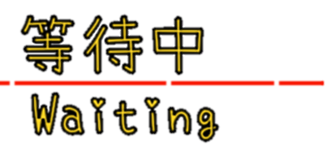

# OBS 直播狀態顯示

## 預覽
<p></p>

## 工具網址
[https://stinkingbanana.github.io/liveinfo/liveinfo.html](https://stinkingbanana.github.io/liveinfo/liveinfo.html)


## 參數
* ```top``` = {上行文字}
* ```bot``` = {下行文字}

## 使用方式

* 打開你的OBS Studio
* 加入瀏覽器來源
    * 網址: ```https://stinkingbanana.github.io/liveinfo/liveinfo.html```
    * 寬度: 450 (或足夠的寬度可以顯示)
    * 高度: 250 (或足夠的高度可以顯示)

#### 修改上行文字
* 如果網址裡面**沒有**使用過問號"```?```" 請在網址後面添加 ```?top={上行文字}```
    * 舉例: top=測試中
    * 修改前: ```https://stinkingbanana.github.io/liveinfo/liveinfo.html```
    * 修改後: ```https://stinkingbanana.github.io/liveinfo/liveinfo.html?top=測試中```
* 如果網址裡面**有**使用過問號"```?```"  請在網址後面添加 ```&top={上行文字}```
    * 舉例: top=測試中
    * 修改前: ```https://stinkingbanana.github.io/liveinfo/liveinfo.html?bot=Testing```
    * 修改後: ```https://stinkingbanana.github.io/liveinfo/liveinfo.html?bot=Testing&top=測試中```

#### 修改下行文字
* 如果網址裡面**沒有**使用過問號"```?```" 請在網址後面添加 ```?bot={下行文字}```
    * 舉例: bot=Testing
    * 修改前: ```https://stinkingbanana.github.io/liveinfo/liveinfo.html```
    * 修改後: ```https://stinkingbanana.github.io/liveinfo/liveinfo.html?top=測試中```
* 如果網址裡面**有**使用過問號"```?```"  請在網址後面添加 ```&bot={下行文字}```
    * 舉例: bot=Testing
    * 修改前: ```https://stinkingbanana.github.io/liveinfo/liveinfo.html?top=測試中```
    * 修改後: ```https://stinkingbanana.github.io/liveinfo/liveinfo.html?top=測試中&bot=Testing```

# OBS Live Status Display

## Tool Link
[https://stinkingbanana.github.io/liveinfo/liveinfo.html](https://stinkingbanana.github.io/liveinfo/liveinfo.html)

## Parameters
* ```top``` = {Top Text}
* ```bot``` = {Bot Text}

## TO USE

If you just need the date and clock,  
* Open your OBS Studio
* Add Browser Source
    * URL: ```https://stinkingbanana.github.io/liveinfo/liveinfo.html```
    * Width: 450 (Or enough width to fully display)
    * Height: 250 (Or enough height to fully display)

#### Edit Top Text
* Add ```?top={top text}``` after the url if "```?```" was NOT previously used in the url
    * For example: top=Top%20Testing
    * Before: ```https://stinkingbanana.github.io/liveinfo/liveinfo.html```
    * After: ```https://stinkingbanana.github.io/liveinfo/liveinfo.html?top=Top%20Testing```
* Add ```&top={top text}``` after the url if "```?```" was previously used in the url
    * For example: top=Top%20Testing
    * Before: ```https://stinkingbanana.github.io/liveinfo/liveinfo.html?bot=Bot%20Testing```
    * After: ```https://stinkingbanana.github.io/liveinfo/liveinfo.html?bot=Bot%20Testing&top=Top%20Testing```

#### Edit Bot Text
* Add ```?bot={bot text}``` after the url if "```?```" was NOT previously used in the url
    * For example: bot=Bot%20Testing
    * Before: ```https://stinkingbanana.github.io/liveinfo/liveinfo.html```
    * After: ```https://stinkingbanana.github.io/liveinfo/liveinfo.html?bot=Bot%20Testing```
* Add ```&bot={bot text}``` after the url if "```?```" was previously used in the url
    * For example: bot=Bot%20Testing
    * Before: ```https://stinkingbanana.github.io/liveinfo/liveinfo.html?top=Top%20Testing```
    * After: ```https://stinkingbanana.github.io/liveinfo/liveinfo.html?top=Top%20Testing&bot=Bot%20Testing```