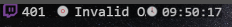

# OBS 直播時間 觀眾人數 顯示器 V2

## 預覽

## 最後更新日期: 
2021/10/18
# 本工具網址

工具網址: [https://stinkingbanana.github.io/livestats2/index.html](https://stinkingbanana.github.io/livestats2/index.html)

Github Repo: [https://github.com/StinkingBanana/StinkingBanana.github.io/tree/master/livestats2](https://github.com/StinkingBanana/StinkingBanana.github.io/tree/master/livestats2)

# 若不需顯示觀眾人數

請直接跳至 [第三步](#step3) 。

# 需顯示觀眾人數

## 第一步: 申請 Twitch 用戶端ＩＤ

[https://dev.twitch.tv/console/apps](https://dev.twitch.tv/console/apps)

1. 從 Twitch 開發人員網站取得您自己的**用戶端 ID**

2. 登入後 點選 註冊您的應用程式

   - 名稱: `Yourname's ViewerCount Display` (隨便取個自己記得的名稱. 不是很重要只要不跟他人重複.)
   - OAuth 重新導向網址: `http://localhost` (直接導向回 localhost 就可以了, 是 http 不是 https 喔)
   - 分類: `Analytics Tool`

3. 新增完新的 APP 之後點進去複製 **用戶端 ID** (請勿與他人分享自己的用戶端 ID), 擷取記錄下來.

## 第二步: 取得 OAuth 認證代碼

### 方法 1. 使用小幫手 ( 建議 )

1. 使用上一步取得的 **用戶端 ID** , 使用 **認證代碼小幫手** 網頁來取得 **認證代碼**  
   [https://stinkingbanana.github.io/livestats2/helper.html](https://stinkingbanana.github.io/livestats2/helper.html)

2. 未來如果需要更新 認證代碼，可以把之前使用OBS使用的設定網址丟給小幫手直接生成新認證代碼。陸續完成後續步驟後，就可以取得最新的設定網址。非常快速更方便。

### 方法 2. 手動設置

1. 使用上一步取得的 **用戶端 ID** , 把下方的網址 {用戶端 ID} 改成自己的 **用戶端 ID**, 之後打開瀏覽器的輸入至網址列並輸入  
   `https://id.twitch.tv/oauth2/authorize?response_type=token&client_id={用戶端ID}&redirect_uri=http://localhost&scope=viewing_activity_read`
2. 假設您的用戶端 ID 是 abcd1234 那您會輸入  
   `https://id.twitch.tv/oauth2/authorize?response_type=token&client_id=abcd1234&redirect_uri=http://localhost&scope=viewing_activity_read`  
   請不要包含{ }
3. 輸入後如果有授權畫面，請點下授權。若成功，頁面跳轉後網址列的網址會變成類似以下網址  
   `http://localhost/#access_token={您需要的認證代碼}&scope=viewing_activity_read&token_type=bearer`
4. 在 #access_token= 後面那段隨機的英文數字是您的 **認證代碼**, 擷取記錄下來.

##  第三步: 設定 OBS

以下設置是假設您的 OBS 的畫布大小是 1920x1080 為前提。  
請打開您的 OBS Studio 或 StreamLab，加入瀏覽器來源後放入網址。  
#### 參數

- `login` = {需要顯示的頻道帳號}
- `clientID` = {您的用戶端 ID}
- `accessToken` = {您的認證代碼}
- `flag` = {國家代碼} {預設: 不顯示}
- `vc` = {觀看人數} (預設: 顯示，若有提供用戶端ID、認證代碼、頻道; 0: 不顯示)
- `st` = {已直播時間} (預設: 顯示，若有提供用戶端ID、認證代碼、頻道; 0: 不顯示)
- `dateFormat` = {更改預設日期顯示模式} (預設: MM/DD/YY ddd; 0: 不顯示)
- `timeFormat` = {更改預設時間顯示模式} (預設: HH:mm:ss Z; 0: 不顯示)
  - 時間與日期的顯示參數 請參考: [https://momentjs.com/docs/#/displaying/format/](https://momentjs.com/docs/#/displaying/format/)

### 不需顯示觀看人數，則不需提供 "頻道帳號"，"用戶端ID" 與 "認證代碼"

#### 未提供任何參數下，預設 顯示 "日期", "時間", "時區"

   - 網址: `https://stinkingbanana.github.io/livestats2/index.html`
   - 參考 寬度: 455 高度: 22

#### 修改日期與時間格式，顯示 "日期 但不包含年分", "時間 但不包含時區"

   - 網址: `https://stinkingbanana.github.io/livestats2/index.html?dateFormat=MM/DD ddd&timeFormat=HH:mm:ss`
   - 參考 寬度: 455 高度: 22

#### 不顯示日期 ; 只顯示 "時間 但不包含時區"

   - 網址: `https://stinkingbanana.github.io/livestats2/index.html?dateFormat=0&timeFormat=HH:mm:ss`
   - 參考 寬度: 455 高度: 22

### 需要顯示觀看人數

#### 預設顯示 "觀看人數", "已直播時間", "日期", "時間", "時區"

   - 網址: `https://stinkingbanana.github.io/livestats2/index.html?login={需要顯示的頻道帳號}&clientID={您的用戶端ID}&accessToken={您的認證代碼}`
   - 參考 寬度: 660 高度: 22

#### 預設顯示 並包含 "國旗"

   - 網址: `https://stinkingbanana.github.io/livestats2/index.html?login={需要顯示的頻道帳號}&clientID={您的用戶端ID}&accessToken={您的認證代碼}&flag=tw`
   - 參考 寬度: 695 高度: 22

#### 不顯示 "觀看人數" ; 只顯示 "已直播時間", "日期", "時間"

   - 網址: `https://stinkingbanana.github.io/livestats2/index.html?login={需要顯示的頻道帳號}&clientID={您的用戶端ID}&accessToken={您的認證代碼}&vc=0`
   - 參考 寬度: 595 高度: 22

#### 不顯示 "已直播時間" ; 只顯示 "觀看人數", "日期", "時間"

   - 網址: `https://stinkingbanana.github.io/livestats2/index.html?login={需要顯示的頻道帳號}&clientID={您的用戶端ID}&accessToken={您的認證代碼}&st=0`
   - 參考 寬度: 595 高度: 22

# 參數使用說明

#### 例子: 附加顯示 "國旗" 

- 如果網址裡面**沒有**使用過問號"`?`" 請在網址後面添加 `?flag={國家代碼}`
  - 舉例: 臺灣
  - 修改前: `https://stinkingbanana.github.io/livestats2/index.html`
  - 修改後: `https://stinkingbanana.github.io/livestats2/index.html?flag=tw`
- 如果網址裡面**有**使用過問號"`?`" 請在網址後面添加 `&flag={國家代碼}`
  - 舉例: 臺灣
  - 修改前: `https://stinkingbanana.github.io/livestats2/index.html?login={需要顯示的頻道帳號}&clientID={您的用戶端ID}&accessToken={您的認證代碼}`
  - 修改後: `https://stinkingbanana.github.io/livestats2/index.html?login={需要顯示的頻道帳號}&clientID={您的用戶端ID}&accessToken={您的認證代碼}&flag=tw`
- 國家代碼請參照 [ISO 3166-1 alpha-2](http://en.wikipedia.org/wiki/ISO_3166-1_alpha-2)
- 請在原來的寬度再加上 `35` 或是 足夠的寬度直到您看見國旗顯示出來

# 備註

1. OBS 與 Streamlabs 都通用

2. 寬度與高度如有問題，請自行更改符合自己的寬度與高度。

3. "**直播時間**" 與 "**觀看人數**" 需要開台後約 1~2 分鐘才會刷新，一開始會顯示 `...`。

4. 如果按造以上輸入指定的參數，但還是沒有顯示人數，請檢查所有參數的拼字。尤其是 "`accessToken`"。

5. 如果**已直播時間**顯示 401 Invalid OAuth token, 請重新使用[第二步](#step2)拿取新的認證代碼, 因為認證代碼是有時效性的。

1. 本工具原始碼是公開。邏輯很簡單，不包含第三方依賴庫，也不包含任何追蹤或廣告。很單純只有使用 HTML, CSS, Javascript 而已。

2. 有任何需要幫助, 請使用 Discord 聯繫我 [https://discord.me/stinkingbanana](https://discord.me/stinkingbanana)

3. 最後，這工具本來只是做給自己用的，對我來說堪用就好。但若您有甚麼建議，可以提出讓我參考參考。未來有時間可以把這工具做得更好一些。感恩。

# 目前已知有在使用本工具的 Twitch 台主

**若不想在這邊被列出，再麻煩您通知我一下，我會立即移除。**  
**若想在這邊被列出，也麻煩您通知我一下，我會立即新增。**  
**本紀錄只是為了讓各位能看到實際使用的範例。**  

- https://www.twitch.tv/stinkingbanana
- https://www.twitch.tv/vivinanaa
- https://www.twitch.tv/abc1118n
- https://www.twitch.tv/k0ch1a
- https://www.twitch.tv/dragon0122
- https://www.twitch.tv/peanut_ouo
- https://www.twitch.tv/joansven
- https://www.twitch.tv/selfish77
- https://www.twitch.tv/lunch0604
- https://www.twitch.tv/lpc071216

# 更新

2021/10/18
- 增加不顯示日期 / 時間 選項

2021/04/09

- 更新錯字, 新增網址小幫手
- 新增可調整日期與時間格式

2020/05/01

- 因應 Twitch 強制要求 Oauth 認證流程, 更改認證方式:  
  [https://discuss.dev.twitch.tv/t/requiring-oauth-for-helix-twitch-api-endpoints/23916](https://discuss.dev.twitch.tv/t/requiring-oauth-for-helix-twitch-api-endpoints/23916)
