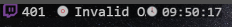

# OBS 直播時間 觀眾人數 顯示器 V2

## 預覽
<p></p>

## 更新
2020/05/01 因應 Twitch 強制要求 Oauth 認證流程, 所以使用步驟稍微增加  
[https://discuss.dev.twitch.tv/t/requiring-oauth-for-helix-twitch-api-endpoints/23916](https://discuss.dev.twitch.tv/t/requiring-oauth-for-helix-twitch-api-endpoints/23916)

## 工具網址
[https://stinkingbanana.github.io/livestats2/index.html](https://stinkingbanana.github.io/livestats2/index.html)

# 使用方式

## 第一步: 申請用戶端ＩＤ
[https://glass.twitch.tv/console/apps](https://glass.twitch.tv/console/apps) 

1. 從Twitch開發人員網站取得你自己的**用戶端 ID** 

2. 登入後 點選 註冊您的應用程式
    * 名稱: ```Yourname's ViewerCount Display``` (隨便取個自己記得的名稱. 不是很重要只要不跟他人重複.)
    * OAuth 重新導向網址: ```http://localhost``` (直接導向回localhost就可以了, 是http不是https喔)
    * 分類: ```Analytics Tool```

3. 新增完新的APP之後點進去複製 **用戶端ID** (請勿與他人分享自己的用戶端ID), 擷取記錄下來.


## <a name="step2"></a>第二步: 取得 OAuth 認證代碼
#### 方法 1.
1. 使用上一步取得的 **用戶端 ID** , 把下方的網址 {用戶端ID} 改成自己的 **用戶端 ID**, 之後打開瀏覽器的輸入至網址列並Enter  
```https://id.twitch.tv/oauth2/authorize?response_type=token&client_id={用戶端ID}&redirect_uri=http://localhost&scope=viewing_activity_read```  
1. 假設你的用戶端ID是abcd1234 那你會輸入  
```https://id.twitch.tv/oauth2/authorize?response_type=token&client_id={用戶端ID}&redirect_uri=http://localhost&scope=viewing_activity_read```  
請不要包含{ }
1. Enter 如果有授權畫面, 請點下授權, 之後就不會有畫面, 但是網址列的網址會改變, 類似於  
```http://localhost/#access_token={你需要的認證代碼}&scope=viewing_activity_read&token_type=bearer```
1. 在 #access_token= 後面那段隨機的英文數字是你的 **認證代碼**, 擷取記錄下來.

#### 方法 2.
1. 使用上一步取得的 **用戶端 ID** , 使用 **認證代碼小幫手** 網頁來取得 **認證代碼**   
[https://stinkingbanana.github.io/livestats2/helper.html](https://stinkingbanana.github.io/livestats2/helper.html)

## 第三步: 設定OBS
以下設置是假設你的OBS的畫布大小是1920x1080為前提

#### 參數
* ```login``` = {需要顯示的頻道帳號}
* ```clientID``` = {你的用戶端 ID}
* ```accesssToken``` = {你的認證代碼}
* ```flag``` = {國家代碼}
* ```vc``` = {0: 不顯示觀看人數}
* ```st``` = {0: 不顯示已直播時間}

#### 顯示全部 "觀看人數", "已直播時間", "日期", "時間", "國旗“
1. 打開你的OBS Studio
1. 加入瀏覽器來源
    * 網址: ```https://stinkingbanana.github.io/livestats2/index.html?login={需要顯示的頻道帳號}&clientID={你的用戶端ID}&accesssToken={你的認證代碼}&flag=tw```
    * 寬度: 695
    * 高度: 22

#### 顯示 "日期", "時間"
1. 打開你的OBS Studio
1. 加入瀏覽器來源
    * 網址: ```https://stinkingbanana.github.io/livestats2/index.html```
    * 寬度: 455
    * 高度: 22

#### 顯示 "觀看人數", "已直播時間", "日期", "時間"
1. 打開你的OBS Studio
1. 加入瀏覽器來源
    * 網址: ```https://stinkingbanana.github.io/livestats2/index.html?login={需要顯示的頻道帳號}&clientID={你的用戶端ID}&accesssToken={你的認證代碼}```
    * 寬度: 660
    * 高度: 22

#### 顯示 "已直播時間", "日期", "時間"; 不顯示 "觀看人數"
1. 打開你的OBS Studio
1. 加入瀏覽器來源
    * 網址: ```https://stinkingbanana.github.io/livestats2/index.html?login={需要顯示的頻道帳號}&clientID={你的用戶端ID}&accesssToken={你的認證代碼}&vc=0```
    * 寬度: 595
    * 高度: 22

#### 顯示 "觀看人數", "日期", "時間"; 不顯示 "已直播時間"
1. 打開你的OBS Studio
1. 加入瀏覽器來源
    * 網址: ```https://stinkingbanana.github.io/livestats2/index.html?login={需要顯示的頻道帳號}&clientID={你的用戶端ID}&accesssToken={你的認證代碼}&st=0```
    * 寬度: 595
    * 高度: 22

#### 附加顯示 "國旗"
* 如果網址裡面**沒有**使用過問號"```?```" 請在網址後面添加 ```?flag={國家代碼}```
    * 舉例: 臺灣 
    * 修改前: ```https://stinkingbanana.github.io/livestats2/index.html```
    * 修改後: ```https://stinkingbanana.github.io/livestats2/index.html?flag=tw```
* 如果網址裡面**有**使用過問號"```?```"  請在網址後面添加 ```&flag={國家代碼}```
    * 舉例: 臺灣
    * 修改前: ```https://stinkingbanana.github.io/livestats2/index.html?login={需要顯示的頻道帳號}&clientID={你的用戶端ID}&accesssToken={你的認證代碼}```
    * 修改後: ```https://stinkingbanana.github.io/livestats2/index.html?login={需要顯示的頻道帳號}&clientID={你的用戶端ID}&accesssToken={你的認證代碼}&flag=tw```
* 國家代碼請參照 [ISO 3166-1 alpha-2](http://en.wikipedia.org/wiki/ISO_3166-1_alpha-2)
* 請在原來的寬度再加上 ```35``` 或是 足夠的寬度直到你看見國旗顯示出來

# 備註
1. "**直播時間**" 與 "**觀看人數**" 需要開台後約1~2分鐘才會刷新

2. 如果**已直播時間**顯示Invalid OAuth token, 請重新使用[第二步](#step2)拿取新的認證代碼
    <p></p>

3. 有任何需要幫助, 請使用Discord聯繫我 [https://discord.me/stinkingbanana](https://discord.me/stinkingbanana)


